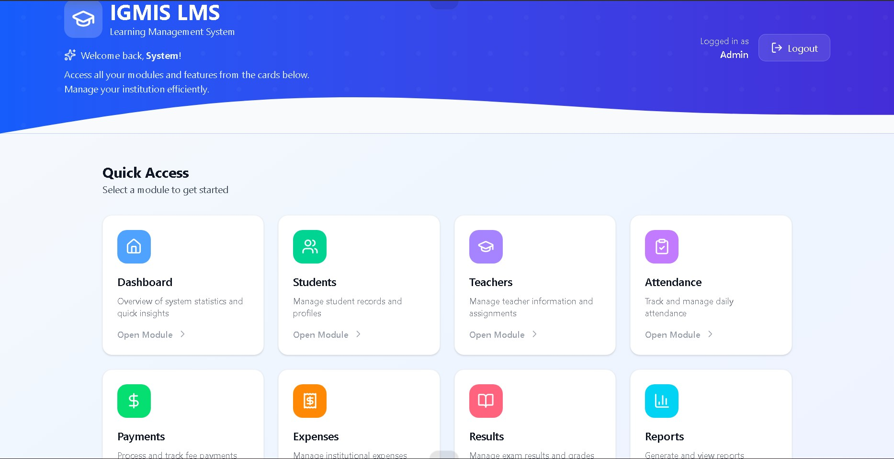
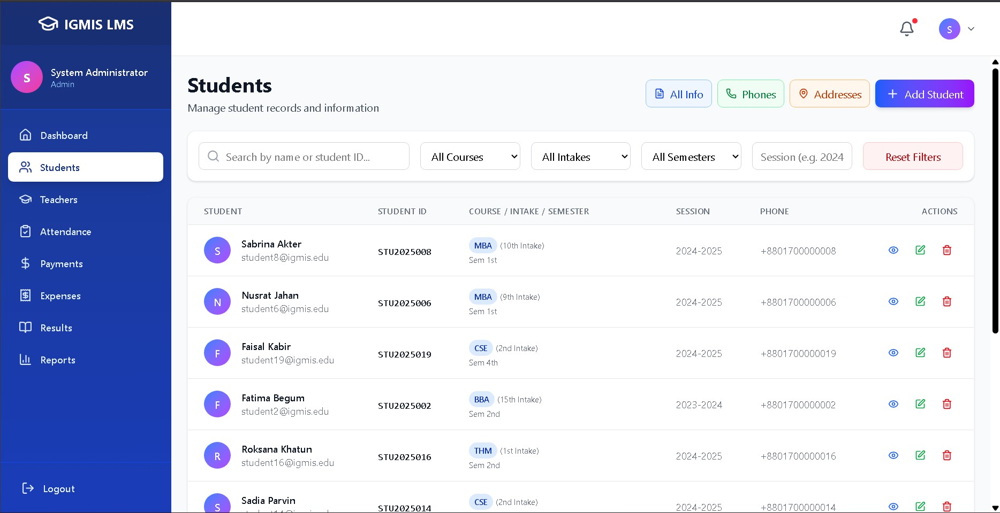
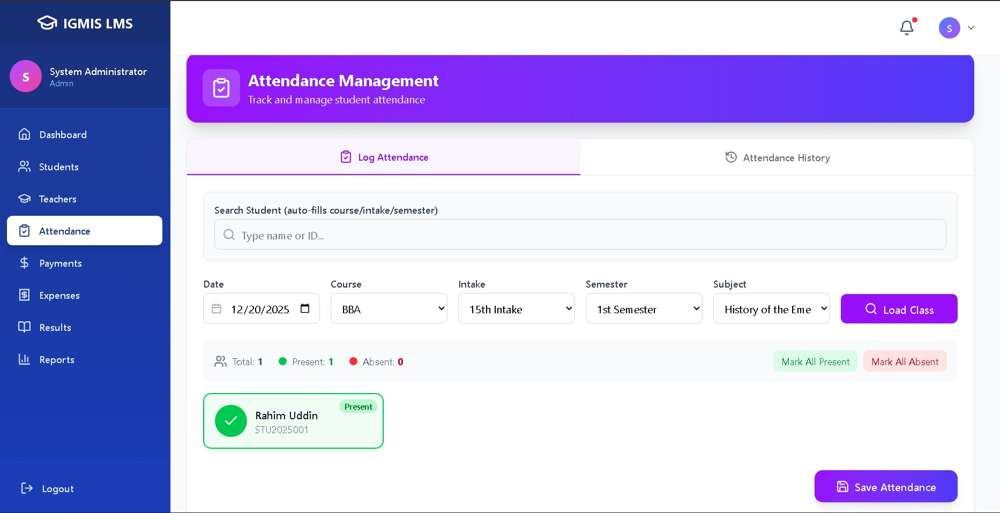
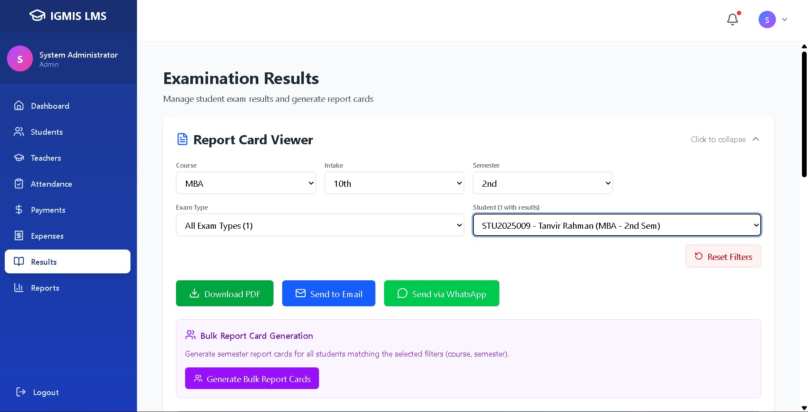
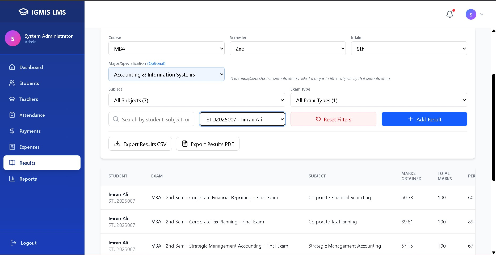

# IGMIS LMS

Integrated General Management & Information System (IGMIS) is a full-stack learning management platform that blends a Django REST backend with a modern Vite + React frontend to streamline academic operations for universities that run multiple programs under the National University curriculum.

> "Seed once, stay consistent" – official syllabus data and grading workflows stay in sync across programs, semesters, and major tracks.

## 📌 At a Glance

- **Multi-course coverage** – ship BBA, MBA, CSE, THM, EEE, and LLB curricula with consistent metadata, fees, and durations ready to seed into the system.
- **Official syllabi ingestion** – import National University syllabi (2015–2018) for every semester and major, ensuring subjects, credits, and marks align perfectly with the source PDFs.
- **Exam + result automation** – generate three canonical exams per subject plus representative sample results so QA teams can test flows without manual data entry.
- **Major-aware result entry** – the React modal matches students with exams/subjects filtered by course, semester, and major to prevent mismatched grades.
- **Full payments & dues tracking** – record student payments, track per-semester dues, and view cumulative balances; export to CSV and PDF.
- **Expenses module** – manage recurring institutional expenses (salaries, rent, utilities) with schedule-based tracking and an outflow ledger.

## 🔄 Recent Highlights

1. **Expenses module** – new dedicated page and backend for tracking institutional outflows. Supports categorised expenses, recurring schedules, and a daily ledger with CSV/PDF export.
2. **Payments revamp** – Payments page now has a *Payments* tab and a *Dues & Receivables* tab; includes per-student edit modal, bulk-edit receivables modal, and Due/Cumulative Due columns in exports.
3. **SemesterSummary model** – stores per-student per-semester financials (opening balance, total received, closing balance, cumulative dues, midterm/NU exam fees, attendance fines).
4. **AdmissionRecord & FeeStructure models** – snapshot the admission sheet and hold reference fee tables per program.
5. **DailyAccount model** – replaces daily Excel cashbooks with a queryable database table.
6. **Coordinator role** – new COORDINATOR user role with add-only permissions (no edit/delete).
7. **Real-data seeding** – `seed_real_data` imports institution CSV exports; `setup_credentials` generates per-student passwords and a coordinator account.

## 🧱 Architecture

| Layer | Stack | Responsibilities |
| --- | --- | --- |
| Backend | Django REST Framework + PostgreSQL | Course catalogs, majors, syllabus metadata, exams, grading, payments, expenses |
| Frontend | React 18 + Vite + Tailwind CSS | Dashboards, student management, grading UX, payments, expenses, analytics |
| Tooling | Netlify (manual deploy) + Vercel (manual backend deploy) | Lightweight hosting with opt-in deployments |

## 🗄️ Database Models

### accounts app

| Model | Purpose |
| --- | --- |
| `User` | Custom user with roles: `ADMIN`, `COORDINATOR`, `TEACHER`, `STUDENT` |
| `Student` | Student profile linked to `User`; stores program, roll number, monthly/semester fees, waiver |

### academics app

| Model | Purpose |
| --- | --- |
| `Course` | Program/course metadata (BBA, MBA, CSE, THM, etc.) |
| `Major` | Major track within a course |
| `Subject` | Subject with credit hours, marks, linked to semester + major |
| `Exam` | Exam record per subject |
| `Result` | Student result for an exam |

### payments app

| Model | Purpose |
| --- | --- |
| `Payment` | Individual student payment; fields: `amount_paid`, `fee_type`, `semester`, `payment_method`, `discount_amount`, `late_fine` |
| `SemesterSummary` | Per-student per-semester financial + attendance snapshot: opening balance, total received, closing balance, cumulative due, midterm/NU exam fees, absence fines |
| `AdmissionRecord` | One-time admission snapshot: application fee, admission fee, waiver, contact, reference |
| `FeeStructure` | Reference fee table per program (item name, unit amount, total); read-only |
| `DailyAccount` | Daily cashbook entry: exam_fee, cash_receive, cash_expense, cash_balance |
| `ExpenseCategory` | User-defined expense category with `kind` (salary/rent/utility/food/conveyance/maintenance/other) and `default_amount` |
| `ExpenseSchedule` | Recurring expense obligation: payee, amount_per_period, frequency (monthly/weekly/quarterly/yearly/one_time), start/end dates |
| `Expense` | Actual outflow record; optionally linked to a `ExpenseSchedule` and `period_label` for partial-payment tracking |

### Payment `fee_type` values

`tuition` · `application_fee` · `admission_fee` · `mt_exam_fee` · `nu_exam_fee` · `semester_fee` · `library_deposit` · `library_fine` · `lab_fee` · `fine` · `other`

## 🖥️ Frontend Pages

| Page | Route | Description |
| --- | --- | --- |
| Dashboard | `/dashboard` | Live KPIs, recent activity |
| Students | `/students` | Directory, search, add/edit students |
| Attendance | `/attendance` | Attendance recording and insights |
| Results | `/results` | Exam results management |
| Reports | `/reports` | Report cards and analytics |
| **Payments** | `/payments` | Two-tab layout: *Payments* (ledger, add/edit, export) and *Dues & Receivables* (per-semester dues table, bulk edit, cumulative view) |
| **Expenses** | `/expenses` | Four-tab layout: *Dues Overview* (expected vs paid vs outstanding), *Schedules* (recurring obligations), *Ledger* (actual outflows), *Categories* (manage expense types) |
| Student Portal | `/student/*` | Student-facing dashboard showing fee structure, closing balance, cumulative dues |

## 🔑 User Roles & Permissions

| Role | Permissions |
| --- | --- |
| `ADMIN` | Full CRUD across all modules |
| `COORDINATOR` | Add-only (can record payments/expenses; cannot edit or delete) |
| `TEACHER` | Academic data access (results, attendance) |
| `STUDENT` | Read-only access to own data via student portal |

## 🚀 Getting Started

### Backend
1. `cd backend`
2. Create and activate a virtual environment.
3. `pip install -r requirements.txt`
4. Copy `.env.example` → `.env` and set database/API secrets.
5. `python manage.py migrate`
6. (Optional) Seed official NU data:
   ```bash
   python manage.py seed_syllabus --clear
   python manage.py seed_exams --clear
   ```
7. (Optional) Seed real institution data from CSVs in `data_to_seed/`:
   ```bash
   python manage.py seed_real_data
   python manage.py setup_credentials   # generates per-student passwords + coordinator account
   ```
8. `python manage.py runserver`

### Frontend
1. `cd frontend`
2. `npm install`
3. Copy `.env.example` → `.env` and set `VITE_API_URL` (e.g., `http://localhost:8000/api`).
4. `npm run dev` and open `http://localhost:5173`.
5. `npm run build` when you're ready to ship.

## 🧭 Project Structure

```
IGMIS LMS
├── backend/
│   ├── academics/       # Courses, subjects, exams, results
│   ├── accounts/        # Users, students, roles
│   ├── payments/        # Payments, expenses, semester summaries, fee structures
│   └── config/          # Settings, permissions, URLs
├── frontend/
│   ├── src/
│   │   ├── components/  # Shared + feature-specific components
│   │   │   ├── expenses/  # ExpenseModal, ScheduleModal, AddCategoryModal
│   │   │   └── payments/  # AddPaymentModal, EditPaymentModal, EditReceivablesModal
│   │   └── pages/       # PaymentsPage, ExpensesPage, DashboardPage, …
├── data_to_seed/        # CSV imports (gitignored; contains PII)
├── images/              # Screenshots used in documentation
└── README.md
```

## 📸 Visual Tour

| Dashboard | Student Directory | Attendance Insights |
| --- | --- | --- |
|  |  |  |

| Report Cards | Results Management |
| --- | --- |
|  |  |

## 🤝 Contribution Workflow

1. Fork the repo and create a feature branch from `main`.
2. Keep course PDFs/ZIPs and seed CSVs local only — they are intentionally gitignored to keep the repo lean and protect student PII.
3. Run linting/tests (`npm run lint`, Django unit tests) before opening a PR.
4. Reference seed commands when adding new programs to guarantee parity with NU documents.

## 📮 Support

Have ideas for new majors, intake automation, or analytics modules? Open an issue or start a discussion in the repo so we can keep modernizing the LMS together.
